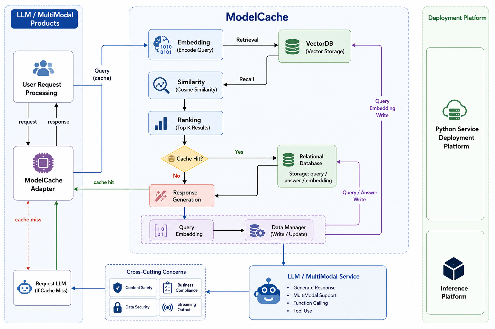

# 🚀 ModelCache: Semantic Caching Layer for LLM Applications

<p align="center">
  
</p>

<p align="center">
  <em>High-Level Semantic Caching Architecture</em>
</p>

<p align="center">
  
  
  
  
  
</p>

<p align="center">
Embedding-based semantic caching system for Large Language Model (LLM) applications.
Reduce redundant API calls, lower inference latency, and optimize operational costs using vector similarity search.
</p>

---

# 📌 Overview

ModelCache is a semantic caching system designed to optimize Large Language Model (LLM) inference pipelines by reducing redundant API calls, lowering latency, and minimizing operational costs.

Instead of relying on exact string matching, the system uses embedding-based similarity search to identify semantically equivalent user queries and reuse previously generated responses.

The system acts as an intelligent middleware layer between applications and LLM providers.

Still an in progress work - working on future improvements , docker deployment and fastAPI architecture.

---

# ⚡ Features

- Semantic similarity-based caching
- Embedding-driven query retrieval
- Vector similarity search using FAISS / VectorDB
- Cache hit / miss routing pipeline
- Configurable similarity thresholds
- Query embedding write-back mechanism
- Multiprocessing embedding dispatcher
- Optimized LLM inference workflows

---

# 🏗️ Architecture

```text
User Query
   ↓
ModelCache Adapter
   ↓
Generate Query Embedding
   ↓
Vector Similarity Search
   ↓
Similarity + Ranking
   ↓
Cache Hit?
   ├── YES → Return Cached Response
   └── NO  → Send Request to LLM
                    ↓
             Generate Response
                    ↓
       Store Query + Embedding + Response
```

---

# 🧠 How Semantic Caching Works

Traditional caching systems rely on exact string matching.

Semantic caching works differently:

```text
"What is semantic caching?"
"Explain semantic cache systems"
```

Even though these queries are phrased differently, they may produce similar embedding vectors.

The system:

1. Converts the query into an embedding vector
2. Searches similar vectors inside a vector database
3. Computes semantic similarity scores
4. Returns cached responses for highly similar queries

This allows semantically equivalent queries to reuse existing LLM outputs.

---

# 📂 Project Structure

```bash
modelcache/
│
├── embedding/
│   ├── base.py
│   ├── huggingface.py
│   ├── bge_m3.py
│   ├── onnx.py
│   └── embedding_dispatcher.py
│
├── adapter/
│   ├── adapter_query.py
│   └── adapter_insert.py
│
├── storage/
├── vectordb/
├── api/
└── data_manager/
```

---

# 🔍 Embedding Pipeline

## Query → Embedding

```python
embedding = embedding_model.encode(query)
```

Example:

```text
"How does semantic caching work?"
↓
[0.12, -0.44, 0.87, ...]
```

The embedding captures semantic meaning rather than exact wording.

---

# 📦 Cache Retrieval Flow

```python
results = vectordb.search(query_embedding)
```

The system:

1. Embeds the incoming query
2. Searches similar cached embeddings
3. Computes similarity scores
4. Ranks candidate responses
5. Returns cached response if threshold is met

---

# 🎯 Similarity Thresholding

```python
if similarity_score > threshold:
    return cached_response
```

If similarity exceeds the configured threshold, the cache returns the stored response instantly.

Otherwise, the request is forwarded to the LLM.

---

# ⚡ Cache Lifecycle

## ✅ Cache Hit

```text
Query → Embedding → Vector Search → Similar Match → Cached Response
```
---

## ❌ Cache Miss

```text
Query → Embedding → No Match → Call LLM → Generate Response → Store Result
```

After generation, the system stores:
- Original query
- Embedding vector
- Generated response
- Metadata

Future semantically similar queries can reuse the response.

---

# 🧩 Core Components

## 1. Embedding Layer

Supported models include:
- HuggingFace Sentence Transformers
- BGE-M3
- ONNX embeddings
- FastText
- PaddleNLP

---

## 2. Vector Database

Stores query embeddings and performs nearest-neighbor retrieval.

Responsibilities:
- Store embeddings
- Perform vector similarity search
- Retrieve semantically similar cached entries

---

## 3. Similarity + Ranking Engine

Computes similarity scores between incoming query embeddings and cached embeddings.

Common metrics:
- Cosine similarity
- Euclidean distance
- Inner product similarity

The ranking layer selects the most relevant cache entries.

---

## 4. Cache Adapter

Acts as middleware between applications and LLM providers.

Responsibilities:
- Handle cache lookups
- Route cache hits
- Handle cache misses
- Trigger cache write-back operations

---

## 5. Response Generation Pipeline

When a cache miss occurs:

1. Request is forwarded to the LLM
2. Model generates a response
3. Query embedding is generated
4. Query + response + embedding are stored

---

## 6. Data Manager

Coordinates:
- Embedding storage
- Response storage
- Metadata updates
- Cache statistics
- Database writes

---

# 🚀 Example Workflow

## User Request

```text
"Explain semantic caching"
```

## Step 1: Generate Embedding

```python
query_embedding = embedding_model.encode(query)
```

## Step 2: Search Vector Database

```python
results = vectordb.search(query_embedding)
```

## Step 3: Similarity Check

```python
if similarity > threshold:
    return cached_response
```

## Step 4: Cache Miss

```python
response = llm.generate(query)
```

## Step 5: Store Result

```python
store(query, embedding, response)
```

---


# 🔮 Future Improvements

- Adaptive similarity thresholds
- Distributed vector search
- Multi-level cache hierarchy
- Cache invalidation policies


